# brassbottle

[](LICENSE)
[](#prerequisites)
[](https://github.com/dmtrio/brassbottle/pulls)
<!-- CI badge — uncomment once ci-staged/ci.yml is applied as .github/workflows/ci.yml:
[](https://github.com/dmtrio/brassbottle/actions/workflows/ci.yml)
-->

Firewalled Docker workspaces for AI coding agents.

`djinn up` turns a small bottle manifest into one project container with cloned
repos, agent CLIs, MCP config, secret shims, artifacts, and an egress allowlist.



## Run One Now

### Prerequisites

- Docker Desktop on macOS, or Docker Engine on Linux.
- `yq` (`brew install yq` on macOS).
- `python3` 3.9+.

### Smoke Test

```bash
git clone https://github.com/dmtrio/brassbottle.git
cd brassbottle
cp bottles/TEMPLATE.yml bottles/my-app.yml
./djinn up my-app
docker ps --filter name=djinn-my-app
docker exec -it -u coder djinn-my-app bash
```

`TEMPLATE.yml` works unedited: with no repos configured it creates
`/workspace/repos/scratch`, and with no identities configured it needs no
secrets. The `docker ps` line should show `djinn-my-app` as `Up`.

Prefer the IDE? Attach with VS Code or Cursor:
**Dev Containers: Attach to Running Container** -> `djinn-my-app`.

## What You Just Got

- A container named from the bottle file: `bottles/my-app.yml` ->
  `djinn-my-app`.
- A workspace volume at `/workspace` with `/workspace/repos` and
  `/workspace/worktrees`.
- Agent CLIs from `agents/*/agent.yml` (`claude`, `codex`, `cursor`, `agy`,
  `pi`, `aider`, `kimi`, depending on your bottle).
- Secret values composed outside the container into per-agent shim env files.
- A default-deny egress firewall; add allowed domains in the bottle or with
  `./djinn allow`.
- Durable non-code output in `/artifacts`.

## Customize Next

- **Your project repos:** edit `repos:` in `bottles/my-app.yml`.
- **Memory:** edit `memory:` in the bottle.
- **Agents:** edit `agents:`; details live in [`agents/`](agents/README.md).
- **MCP/tools:** edit `plugins:`; details live in
  [`plugins/`](plugins/README.md).
- **Secrets:** copy `secrets.env.example` to `.djinn/secrets.env` only when your
  bottle references secret names.

## Where To Go Deeper

| Area | Start here |
|---|---|
| Bottle files and private bottle repos | [`bottles/README.md`](bottles/README.md) |
| Agent descriptors and generated configs | [`agents/README.md`](agents/README.md) |
| Plugins and MCP servers | [`plugins/README.md`](plugins/README.md) |
| Secrets and per-agent identity | [`docs/secrets.md`](docs/secrets.md) |
| Host commands (`djinn allow`, `djinn keys`) | [`bin/README.md`](bin/README.md) |
| Remote hosts and phone access | [`docs/remote.md`](docs/remote.md) |
| Compose overlays | [`compose/README.md`](compose/README.md) |
| Internal implementation modules | [`src/README.md`](src/README.md) |
| Longer guides and container workspace contract | [`docs/README.md`](docs/README.md) |
| Bundled rules | [`rules/README.md`](rules/README.md) |
| Test entry points | [`tests/README.md`](tests/README.md) |

## CLI

```text
./djinn up <name>                 create/update a container from a bottle
./djinn down <name> [--purge]     stop it; --purge removes generated state
./djinn service <plugin> [...]    start a host-side plugin bridge
./djinn allow <name> <domain...>  add live egress domains
./djinn keys <name> ...           inspect or temporarily edit agent keys
```

`up.sh`, `down.sh`, and `service.sh` remain runnable directly; `djinn` is the
short dispatcher in front of them.

## License

[MIT](LICENSE) © Demetrio Urquidi. Use it, modify it, ship it — just keep the
copyright and license notice on copies and derivatives.
