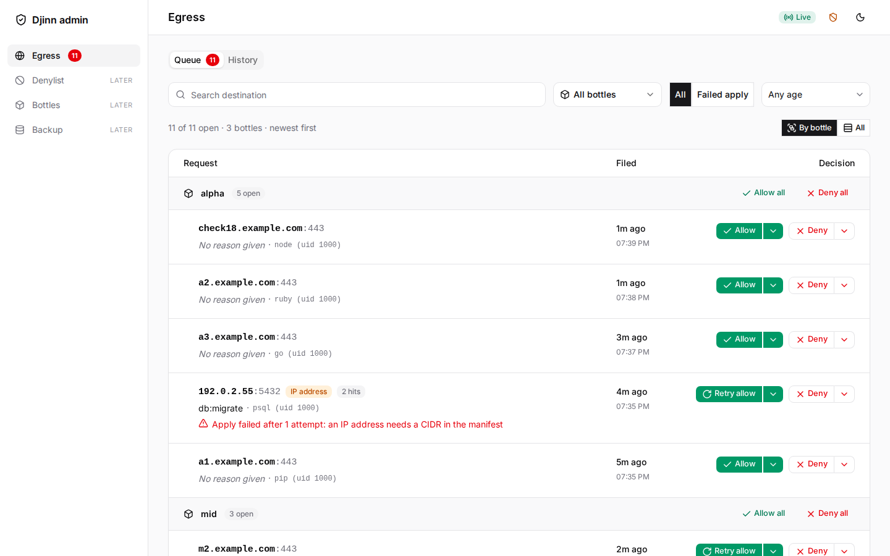
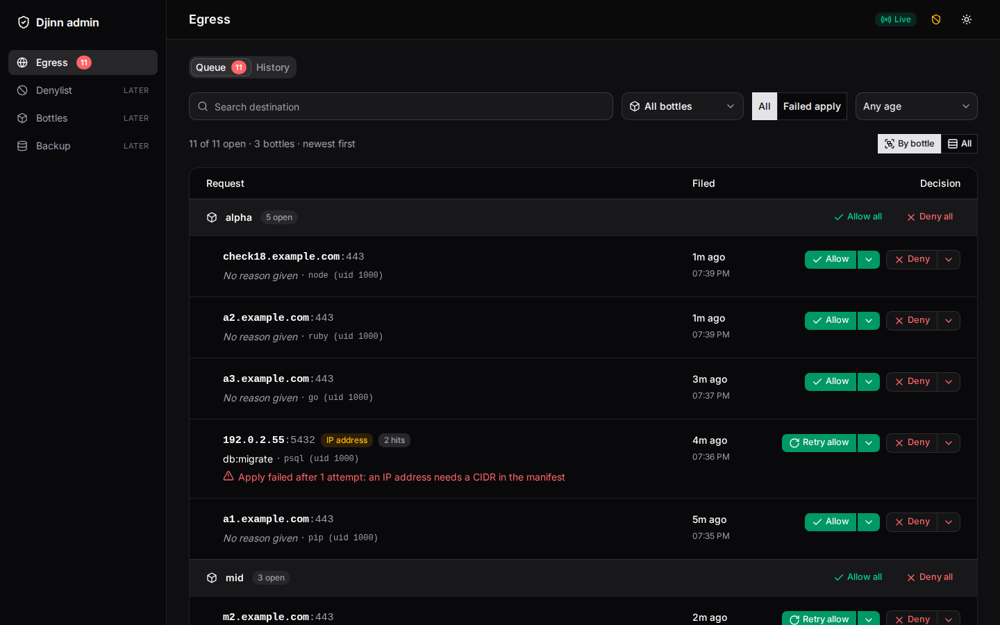
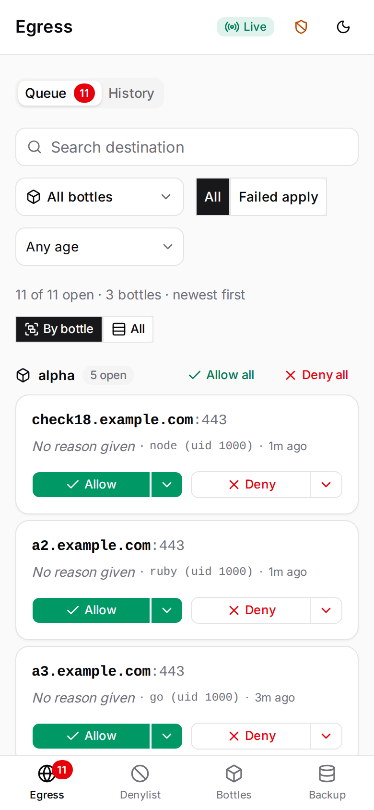
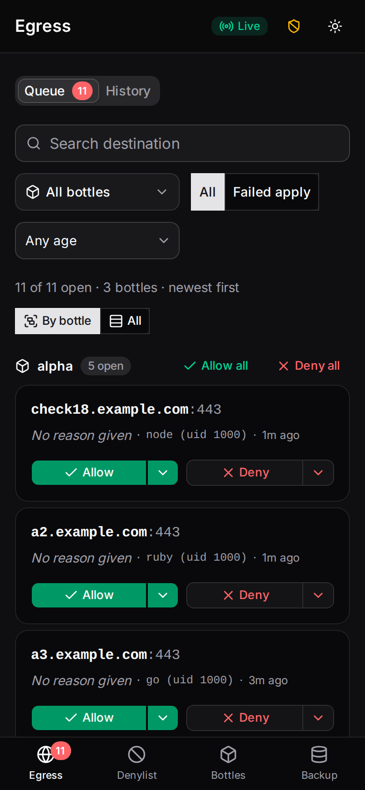
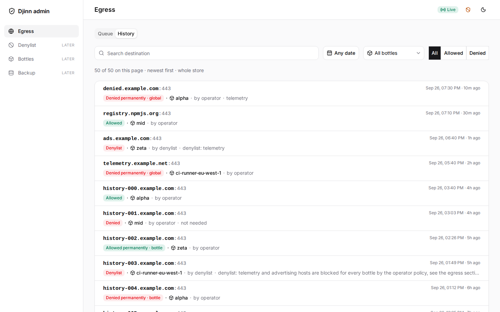
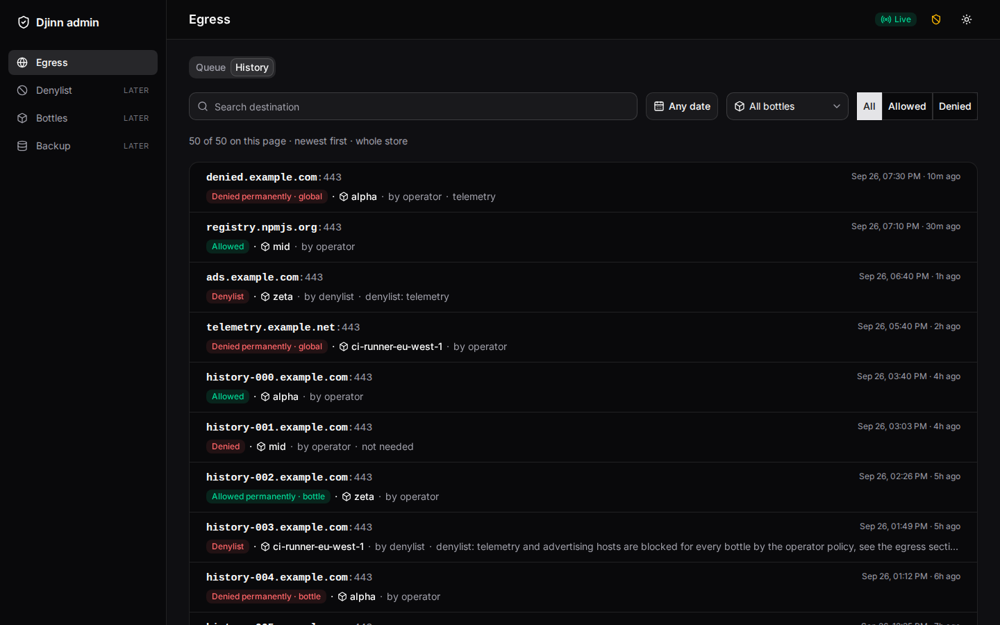
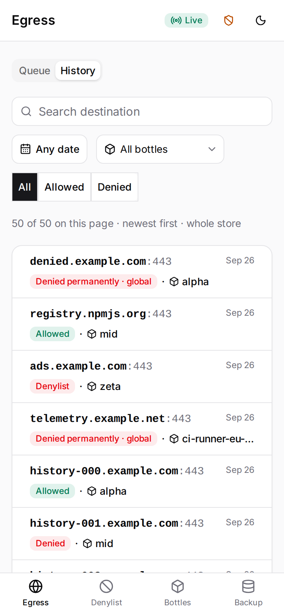
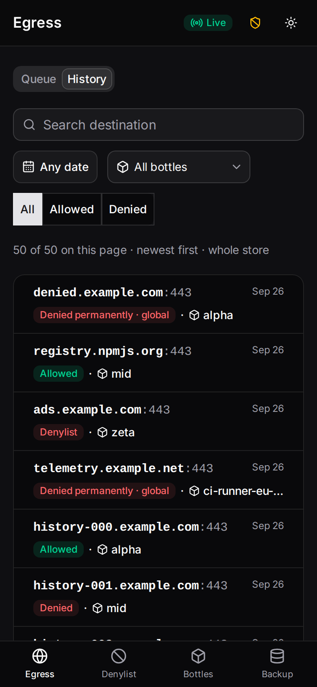

# Egress approval

Outbound traffic from djinn containers is firewall allowlisted. When a process
hits a destination that is not yet allowed, the egress broker holds the request
until an operator approves or denies it.

## Service

The broker and the admin page run as a docker compose singleton — no terminal
has to stay open:

```
./djinn egress start   # build + start both containers, print the session URL
./djinn egress stop
./djinn egress status
./djinn egress logs [-f]
./djinn egress url     # the admin session URL (one page-load signs you in)
./djinn egress ip      # the broker's static djinn-net address
```

`start` renders `$DJINN_HOME/egress/docker-compose.yml` and drives
`docker compose -p djinn-egress`. Two services from one image
(`egress/Dockerfile`), both `restart: unless-stopped`:

- `broker` — `egress_broker_host.py` on `djinn-net` at a static address
  (`EGRESS_BROKER_HOST`, offset 3 of the bridge subnet; `./djinn egress ip`
  prints it) and published on `127.0.0.1:8816`. It applies allows by
  exec'ing `bin/allow-egress.sh` through the **docker socket mounted at
  `/var/run/docker.sock`**: the host-side `docker`/`yq`/python3 the script
  needs live inside the image, and the socket is what lets it exec into
  bottles and edit manifests without any terminal on the host. `DOCKER_HOST`
  selects the socket (`unix://<path>`), anything else is refused.
- `admin` — `admin_daemon.py` on the compose-private `egress-backend`
  network only (no bottle has a route to it), published on `127.0.0.1:8817`.

Open the admin page from the URL `./djinn egress url` prints
(`http://127.0.0.1:8817/session?key=…`): that one page-load sets the session
cookie. The bare page address serves a pointer page and sets nothing, and a
bottle gets no session over the host gateway either way. The session key and
the operator token live under `$DJINN_HOME/run/egress/`, created host-side
before the containers start.

`EGRESS_ACTIONS_URL` (environment or `secrets.env`) points ntfy action
buttons at an address a phone can reach (the broker's container bind is
`0.0.0.0`, which no phone can dial) — unset means no action buttons.

`EGRESS_BROKER_HOST` reaches bottles through `./djinn up` (derived by
`src/manifest.py` from `DJINN_SUBNET`/`DJINN_EGRESS_IP`; `init-firewall.sh`
opens `EGRESS_BROKER_HOST:8816` the way it opens `HOST_MCP_PORTS`), so a
bottle created before the service existed files at its old address and needs
its next `./djinn up`. `up.sh` prints one warning when the service is down;
bring it up with `./djinn egress start`.

### Subnet drift

If `djinn-net` already exists with a subnet different from `DJINN_SUBNET`
(`ensure_net` only warns and keeps the bridge), both the broker and the
bottles follow the **live bridge**: `egress start` renders the compose file
with the live address, and `up.sh` re-resolves `EGRESS_BROKER_HOST` after
`ensure_net` with the same live-bridge resolver instead of passing the
desired-subnet derivation. Verify after a drift with `./djinn egress ip` and
the `⚠ egress:` line in `./djinn up` output — both should name the same
subnet, and a bottle brought up after that files (and is firewall-granted)
at that live address.

## Operator surface (primary: `djinn admin`)

`./djinn egress start` is the primary decision surface for open egress
requests: it runs the admin page as a service (above). `./djinn admin` still
runs the same app as a host-side loopback daemon (`http://127.0.0.1:8817` by
default) when you want it outside docker; it needs `admin/ui/dist` built (see
*The Egress page*).

The browser session gate on `POST /api/egress/decide` is intentionally narrow:
it defends against hostile web pages (CSRF and DNS-rebinding style requests)
with a strict cookie + header + origin/host policy, but it does **not** defend
against local processes running as the same user. Local processes can already
read the operator token file from disk, so loopback binding is the real trust
boundary.

### The Egress page

The admin is a Vue app (`admin/ui/`, built into `admin/ui/dist/`, which the
daemon serves and nothing else: `/` opens the Egress page). The egress image
builds it. Under `./djinn admin` on the host, build it once first with
`cd admin/ui && npm ci && npm run build`; the daemon logs an error and exits 1
when `dist/index.html` is missing. The page shows the open requests and, below
them, the recent decisions.

- **Views** — *By bottle* groups requests under a header per bottle (the
  `container` field) with its open count, bottles alphabetical and each
  bottle's requests newest first; *All* lists every request newest first with
  the bottle on the second line. The tab title carries the open count.
- **A request row** — `host:port` with its hit count, the bottle, the filing
  reason (or "No reason given"), the time it opened, an *IP address* marker on
  IP-literal hosts, and, when the broker reports `attempt`/`last_error`, the
  failed-apply text (for example "Apply failed after 1 attempt: an IP address
  needs a CIDR in the manifest").
- **Actions** — *Allow* (live) and *Deny* (once) are buttons on the row. The
  menus beside them offer *Allow permanently · bottle* (manifest) and
  *Deny permanently · bottle* or *· global*. A permanent deny opens a dialog
  with an optional reason (up to 200 characters); the global one asks for the
  exact host to be typed and refuses anything else. A row's controls lock
  while its decision is in flight, and its outcome (recorded, applied, failed,
  or an IP that needs a CIDR by hand) stays on the row.
- **Filters** — a destination search, a bottle multi-select, a *Request state*
  toggle (all, or only *Failed apply*) and an age bucket (under 5 minutes,
  under an hour, older). *Clear* resets them; the count line reads
  `N of M open`.
- **Bulk** — *Allow all* and *Deny all* on a bottle send one decide per open
  request of that bottle, one at a time, whatever the filters hide, and report
  every request when done.
- **Live queue** — the page holds one `GET /api/egress/stream` (server-sent
  events) per browser, however many admin tabs are open, and the top bar says
  *Live*, *Connecting*, *Reconnecting*, *Polling* or *Paused*. Without the
  stream it polls `GET /api/egress/queue` every 5 s. A failed read or decide
  raises a banner and the last good data stays on screen.
- **Alerts** — the bell asks for the browser's Notification permission only when
  clicked, then raises one notification per request that is new to the tab
  (clicking it focuses the row); a second click mutes it.
- **Install** — a manifest and a service worker let Chromium and Safari install
  the page ("Add to home screen"). The worker caches only the hashed files
  under `/assets/`; `/` and `/api/*` always come from the network.

The Denylist, Bottles and Backup entries in the navigation are placeholders.

| Desktop, light | Desktop, dark | Phone, light | Phone, dark |
|---|---|---|---|
|  |  |  |  |

Every decision uses the same `POST /api/egress/decide` (below); the row keeps
the broker's honesty fields (`apply_failed`, `ip_requires_cidr`, the "decision
recorded" fallback) on screen.

### Recent decisions and History

*Recent decisions (24 h)* lists what the broker decided in the last 24 hours,
newest first: the destination, the bottle, the outcome (status and scope, the
apply status when it is not `applied`, and the deny reason when set) and the
time. Hits on the denylist are not decisions anyone made, so they sit in one
collapsed group with a summed count. A broker that does not report a `recent`
list shows none.

The *History* tab pages the whole decision store newest first, 50 to a page
(*Older* / *Newer*), and filters by day or date range, by bottle, by outcome
(*All*, *Allowed*, *Denied*) and by a search over the loaded page.

| Desktop, light | Desktop, dark | Phone, light | Phone, dark |
|---|---|---|---|
|  |  |  |  |

### Decision action mapping

The admin posts one of five actions, mapped to broker `/decide`:

- `allow_live` -> `decision=allow`, `scope=live`
- `allow_manifest` -> `decision=allow`, `scope=manifest`
- `deny` -> `decision=deny`, `scope=once`
- `deny_bottle` -> `decision=deny`, `scope=bottle`
- `deny_global` -> `decision=deny`, `scope=global`

`deny_global` intentionally omits `container`; other actions require it.

### Decisions, not current state

The queue panel shows **open approval requests and decisions** only. It does
not show currently-permitted hosts; the ipset allowlist remains the runtime
authority.

### Broker endpoints

- `GET /health` — no auth; returns `{"status":"ok"}`.
- `POST /egress` — bottle bearer token; files or coalesces one request.
- `POST /decide` — operator bearer token; applies allow/deny decisions.
- `GET /queue` — operator bearer token; returns the daemon's current queue
  snapshot for UI clients:

```json
{
  "open": [
    {
      "request_id": "deadbeef",
      "container": "coding-brassbottle",
      "host": "192.0.2.55",
      "port": 5432,
      "host_is_ip": true,
      "opened_at": "2026-08-31T23:00:00Z",
      "age_seconds": 12,
      "hit_count": 3,
      "uid": 1000,
      "comm": "curl",
      "reason": "npm install"
    }
  ],
  "count": 1,
  "generated_at": "2026-09-01T00:05:00Z"
}
```

`GET /queue` reports open decision requests only. It must never be interpreted
as "currently allowed hosts" state; ipset `allowed-domains` is the sole
authority for active permit checks.

## Loopback is never filed

Traffic to `127.0.0.0/8` is local, not egress, and never reaches the operator
queue. Two guards enforce it:

- The nat REDIRECT rule carries `! -d 127.0.0.0/8`, so a local service on
  :80/:443 is not intercepted at all.
- The broker refuses a loopback destination at the socket. A dial to its own
  listen port (`127.0.0.1:3128`) is logged as `self_dial` and closed; any other
  loopback destination is spliced straight through.

The self-dial case means a process has `http_proxy`/`https_proxy` pointed at
`127.0.0.1:3128`. The broker is a *transparent* proxy — it reads the
destination from the kernel via `SO_ORIGINAL_DST` — and takes no forward-proxy
clients, so such a request cannot succeed: it is logged as `self_dial`, answered
with a local `502` (or a TLS alert on :443), and closed without filing
anything. Unset those variables in the bottle — until they are, every request
the process makes fails this way, and the only record is the `self_dial` log
line. Before this was refused at the socket the same request was *filed*, and
surfaced as an IP-literal approval prompt no operator answer could clear.

## Notifications

When `NTFY_URL` is set, every new egress request also publishes one ntfy push.
Use the same values as the tmux idle notifier:

- `NTFY_URL` — bare origin (for example `https://ntfy.example.com`)
- `NTFY_TOPIC` — optional; defaults to `djinn-agents`
- `NTFY_TOKEN` — optional bearer token for authenticated servers

Set these in `$DJINN_HOME/secrets.env` and subscribe to the topic on each
device, then restart the egress service: `./djinn egress stop && ./djinn
egress start`.

Without `NTFY_URL`, no push is sent; open requests wait on the admin page
(`./djinn egress url` from the service section).

### Action buttons

ntfy action buttons appear only when the broker binds an address a device can
dial: not loopback, and not the unspecified `0.0.0.0` / `::`. Set the address
the devices reach as `EGRESS_ACTIONS_URL` for the egress service (see the
service section); unset, the pushes carry no buttons and the admin page is the
decision surface.

With actions enabled, each push includes HTTP buttons that call the broker
`POST /decide` endpoint using the operator bearer token. That token is embedded
in the notification payload sent to the ntfy server and delivered to every
subscribed device.

**Do not use the public ntfy.sh service for action buttons.** Request metadata
includes container names and destination hosts. Self-host ntfy on your VPN or
private network instead.

Button behavior:

- **Allow** — live allow for the request's host zone
- **Allow + persist** — allow and write the zone into the bottle manifest
- **Deny** — deny with reason `denied from notification`

IP-literal destinations (for example `192.0.2.55:5432`) cannot be allowed via
`/decide` (they require a manifest CIDR grant). Those pushes show a warning tag
and only a **Deny** button.

### `POST /decide` response shape

Allow responses always include `decided` and `apply_failures`:

- `decided` — request ids that were fully closed by the allow decision.
- `apply_failures` — objects of `{request_id, reason}` for requests that matched
  the zone but stayed open because no rule was installed.

`reason` is one of:

- `ip_requires_cidr` — request host is an IP literal; add a matching CIDR to
  the bottle manifest (`capabilities.egress_cidrs`) by hand.
- `apply_failed` — `allow-egress.sh` did not install the rule.

When a request appears in `apply_failures`, it remains open and still appears in
`GET /queue` until a later allow succeeds or it is denied.

Deny responses are unchanged: they return `decided` (and `persisted` for
`scope=bottle|global`) and do not include `apply_failures`.

## Persistent deny list

`./djinn deny <zone> --bottle NAME|--global` writes an entry to
`$DJINN_HOME/run/egress/denylist.json` that short-circuits future requests for
that zone before an operator is ever prompted; `./djinn undeny` removes one.
`./djinn deny --list` reads the same file; so does `bin/allow-egress.sh`
internally, via `egress_denylist.py --check <bottle> <domain>...` (a bare
bypass with no `./djinn` front-end — it is not a `deny` flag).

### Audit log fields for a denylist-caused denial

A `denied` event in the audit log (`$DJINN_HOME/run/egress/*.jsonl`) can be
caused by a persisted deny-list entry in two ways: an already-denylisted zone
short-circuits the request outright (no hold, no operator prompt), or a
brand-new entry (`./djinn deny` / the admin page's deny-always actions /
`/decide` with `scope=bottle|global`) sweeps closed any request it now covers. Both cases
write the same three fields to name the entry that caused the denial:

- `via` — always the literal string `"denylist"`.
- `zone` — the entry's zone (the value that was persisted, not necessarily
  the exact host that triggered the check — a zone covers its subdomains).
- `denylist_scope` — the entry's own scope as written to disk: a bottle name,
  or `"global"`.

`scope` on a `denied` event keeps its plain-deny meaning — the *request's*
own scope (`once`/`bottle`/`global`), i.e. what was asked for, not what the
matched entry is scoped to — and is absent entirely on a short-circuited
denial, since no `/decide` call ever happened for it. `reason` stays free
text throughout: the operator's own explanation (from `./djinn deny --reason
...` or the matched entry's own `reason`, if either was given), never the
literal string `"denylist"` — that literal is confined to the HTTP response
body a still-held container sees, not the audit event.
